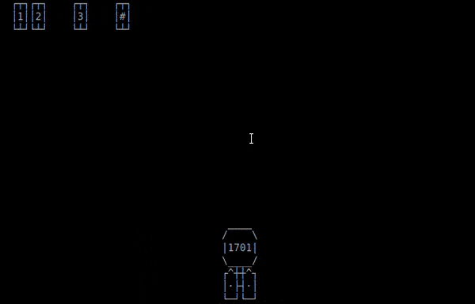
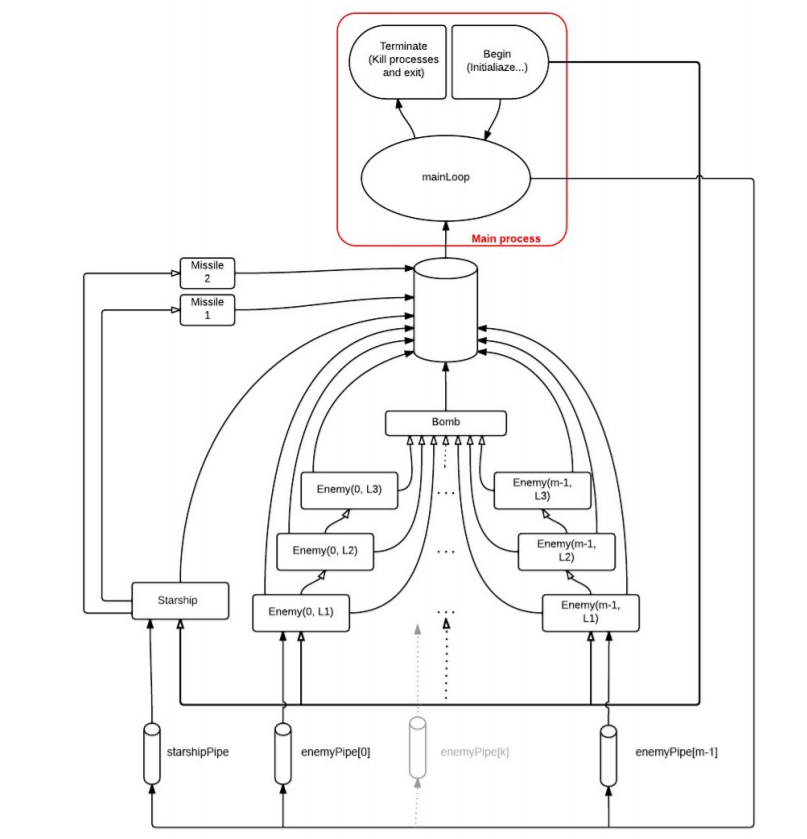
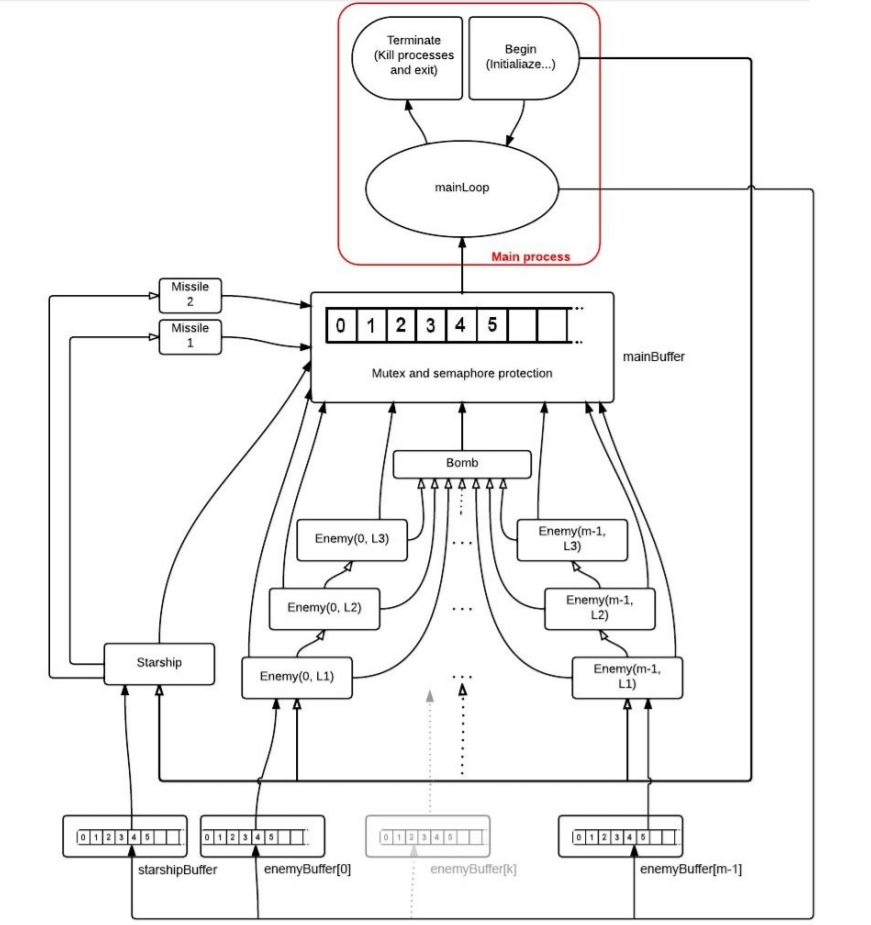

# Space Invaders
## A Linux Bash application

#### By Stefano Melis & Silvia Marras

## Introduction
-------------

This is a software created to demonstrate the use of the Linux system API using the <code>ncurses</code> libraries to simulate the gameplay of the cult videogame Space Invaders. 

This project was made as a final term exam for the course of Operative Systems for the Computer Science degree course at the University of Cagliari, Italy.

## How to install
-------------

Install the ncurses library:

    sudo apt-get install libncurses5-dev

Install the GCC compiler:

    sudo apt-get install gcc

Launch the makefile from one of the folders:

    cd pipe_version

    make

Launch the game:

    ./spaceinvaders.o

## Files structure
--------------

The project consists of two version, one using pipes and one using threads.

Both version uses the following files structure:

* **space_main.c** : it's the application entry point, initializes the game creating the producer tasks (player and enemy ships) and the consumer task (graphics and collision manager);
* **space_game.h** : header for for space_game.c;
* **space_game.c** : main functions used in loop by the tasks;
* **space_model.h** : header for for space_model.c and contains the characters matrixes of the graphic entities;
* **space_model.c** : lifecycle algorithms of the graphics entities (initialization and rendering);
* **space_comm.h** : header for space_comm.c;
* **space_comm.c** : communication functions.

## Pipe version
-------------

In this version of the project we used the linux-pipe according this configuration:

* 1 Consumer task;
* M+1 Producer tasks, where M+1 is the number of the enemy starships plus the player starship;
* 1 mainPipe;
* M enemyPipe;
* 1 starshipPipe;

The consumer reads the mainPipe, where all the messages by the producers are posted, and writes on the enemyPipes and the starshipPipe to notify them info about collisions. The producers in turn are consumers for the timer.

The entities read from their pipes in non-blocking way, making the communication asynchronous.

To avoid high complexity of the diagram, we omitted the timers, which communicate with the mainPipe like the other tasks.

### (Pipe) Tasks

* **main**: It's generated at startup; initializes the game and generates the processes for the player starship, the enemy starships and the vertical movement timer, their position on the playfield and the communication pipes; as it enters in the lifecycle loop its duty is to mantain an updated list for every entity alive and to render them every time it receives their new coordinates; it manages the collisions between entity and the death of the other processes. It terminates when every enemy starships has been destroyed, or when the player starship get destroyed, or when an enemy starship reaches the lower border of the screen; its last duty is to close the game and to show the score.

* **starship**: This process is controlled by the player and represents the player starship; the player can move her to left or right and fire two missiles using the keyboard; the loop lifecycle for this process is infinite, and can be stopped only upon a collision with another entity, which asks its pid to be killed.

* **enemy**: This process represents an enemy starship and can move to the left, to the right or to the bottom of the screen. To move sends to the mainLoop the direction and the coordinate for the new position; the mainLoop checks if the new position is not occupied and re-renders the enemy at the new position, otherwise it signal to the entity to come back. The firing is controlled by a timer which orders to open fire after every interval. This process can be killed only by a missile generated by the player, and when it dies generates a new process representing a next-level enemy (up to third level) with the same pipe of the killed one, ensuring continuity for the communication with the mainLoop.

* **missile**: It can move only diagonally. Its life terminates naturally when it reaches the upper, left and right borders of the screen, otherwise upon a collision on an enemy starship.

* **bomb**: It's similar to the missile, but it moves vertically and dies only when it reaches the lower border of the screen or when collides with the player starship.

* **timerMove**: It's created by the main during the initialization phase. It manages the movement for the enemy starships by ordering them to move down at the end of every interval. It dies when the associated entity dies.

* **timerFire**: Generated upon firing by the player, it prevent to fire till its expiration;

### (Pipe) Functions

### space_main.c

* **main**: program's entry point, creates tasks and pipes.

### space_game.c

* **bombInit**: invoked by enemy ship to spawn a bomb;
* **bombloop**: lifecycle loop for the bomb task, it dies when reaches the lower border of the screen;
* **checkCollision**: invokes checkCoordinates passing two variables EntityParams;
* **checkCoordinates**: checks if the areas occupied by the two EntityParams are the same;
* **enemyInit**: initializes enemyLoop;
* **enemyLoop**: lifecycle loop for the enemy starship task. Before diying respawn itself as a next level enemy (max 3 levels);
* **epilogue**: game over function;
* **isAlive**: checks if the passed PID is greater than 1;
* **mainLoop**: consumer loop. Its duty is to read messages from the mainPipe and to execute the appropriate function. Every time a task sends its coordinates, the mainLoop saves them in an array of EntityParams. During the initialization phase, it has the duty of creating a timer task that lowers the enemy ships on the screen.
* **missileLoop**: lifecycle loop for the missile task. It dies when reaches the upper, right and left borders of the screen;
* **missileInit**: invoked by the player, spawns two missiles and a timer;
* **removeEntityFromList**: remove an entity from an array of EntityParams;
* **retrieveSizeInformation**: retrieves the size of an entity;
* **starshipLoop**: lifecycle loop of the player's starship. It can be controlled by keys pressing: spacebar generates two missiles and a timer that prevents spawning more missiles till its expiration; the 2, 4, 8 and 6 on the numpad move the starship on the screen.
* **TimerFire**: when invoked by the player is the timer used to slow down the player's rate of fire, when invoked by an enemy is the timer used to make it fire. 
* **TimerMove**: the interval for moving down the enemy ships.

### space_graphics.c

* **chloader**: returns the chtype associated to the read char;
* **moveEntity**: interface for printEntity
* **moveShip**: similar tu moveEntity, but is related to the model of starship chosen by the player;
* **moveWeapon**: renders the missile/bomb for the entity invoked for;
* **placeEnemy**: places the enemy ships on the playfield at start up.
* **printEntity**: prints the graphic model for the entity passed to.

### space_comm.c

* **createPipe**: create a pipe. It can be blocking or not blocking.
* **receiveMessage**: writes on a pipe a message of type entityParams;
* **sendMessage**: reads on a pipe a message of type entityParams.

## Thread version
-------------

For this version we used the p-thread library according to this configuration: 

* 1 Consumer task;
* M+1 Producer tasks, where M+1 is the number of the enemy starships plus the player starship;
* 1 mainBuffer;
* M enemyBuffer;
* 1 starshipBuffer;

The consumer read the mainBuffer, where the producers messages are posted and writes on the enemyBuffers and the starshipBuffer to notify any collision;

The buffer are built upon global arrays, so that are visible for every thread. Given that they are shared memory spaces we used mutexes to ensure only one thread can write or read them; moreover, for every read there is a semaphore that put threads that read on empty buffers on hold.
Since the ncurses are not thread-safe, a mutex was used every time was necessary to render on the terminal.

To avoid high complexity of the diagram, we omitted the timers, which communicate with the mainBuffer like the other tasks.

### (Thread) Tasks

* **main**: It's generated at startup; initializes the game and generates the threads for the player starship, the enemy starships and the vertical movement timer, their position on the playfield, the mutexes, the semaphores and the counters; as it enters in the lifecycle loop its duty is to mantain an updated list for every entity alive and to render them every time it receives their new coordinates; it manages the collisions between entity and the death of the other processes. It terminates when every enemy starships has been destroyed, or when the player starship get destroyed, or when an enemy starship reaches the lower border of the screen; its last duty is to close the game and to show the score.

* **starship**: This thread is controlled by the player and represents the player starship; the player can move her to left or right and fire two missiles using the keyboard; the loop lifecycle for this process is infinite, and can be stopped only upon a collision with another entity, which invokes a <code>pthread_cancel</code> on its thread-id.

* **enemy**: This process represents an enemy starship and can move to the left, to the right or to the bottom of the screen. To move sends to the mainLoop the direction and the coordinate for the new position; the mainLoop checks if the new position is not occupied and re-renders the enemy at the new position, otherwise it signal to the entity to come back. The firing is controlled by a timer which orders to open fire after every interval. This thread can be terminated only by a missile generated by the player, and when it dies generates a new thread representing a next-level enemy (up to third level) with the same buffer of the killed one, ensuring continuity for the communication with the mainLoop.

* **missile**: It can move only diagonally. Its life terminates naturally when it reaches the upper, left and right borders of the screen, otherwise upon a collision on an enemy starship.

* **bomb**: It's similar to the missile, but it moves vertically and dies only when it reaches the lower border of the screen or when collides with the player starship.

* **timerMove**: It's created by the main during the initialization phase. It manages the movement for the enemy starships by ordering them to move down at the end of every interval. It dies when the associated entity dies.

* **timerFire**: Generated upon firing by the player, it prevent to fire till its expiration;

### (Thread) Functions

### space_main.c

* **main**: program's entry point, creates tasks, mutexes, semaphores and buffer counters.

### space_game.c

* **bombInit**: invoked by enemy ship to spawn a bomb;
* **bombloop**: lifecycle loop for the bomb task, it dies when reaches the lower border of the screen;
* **checkCollision**: invokes checkCoordinates passing two variables EntityParams;
* **checkCoordinates**: checks if the areas occupied by the two EntityParams are the same;
* **enemyInit**: initializes enemyLoop;
* **enemyLoop**: lifecycle loop for the enemy starship task. Before diying respawn itself as a next level enemy (max 3 levels);
* **epilogue**: game over function;
* **isAlive**: checks if the passed PID is greater than 1;
* **mainLoop**: consumer loop. Its duty is to read messages from the mainBuffer and to execute the appropriate requested function. Every time a task sends its coordinates, the mainLoop saves them in an array of EntityParams. During the initialization phase, it has the duty of creating a timer task that lowers the enemy ships on the screen.
* **missileLoop**: lifecycle loop for the missile task. It dies when reaches the upper, right and left borders of the screen;
* **missileInit**: invoked by the player, spawns two missiles and a timer;
* **removeEntityFromList**: remove an entity from an array of EntityParams;
* **retrieveSizeInformation**: retrieves the size of an entity;
* **starshipLoop**: lifecycle loop of the player's starship. It can be controlled by keys pressing: spacebar generates two missiles and a timer that prevents spawning more missiles till its expiration; the 2, 4, 8 and 6 on the numpad move the starship on the screen.
* **TimerFire**: when invoked by the player is the timer used to slow down the player's rate of fire, when invoked by an enemy is the timer used to make it fire. 
* **TimerMove**: the interval for moving down the enemy ships.

### space_graphics.c

* **chloader**: returns the chtype associated to the read char;
* **moveEntity**: interface for printEntity
* **moveShip**: similar tu moveEntity, but is related to the model of starship chosen by the player;
* **moveWeapon**: renders the missile/bomb for the entity invoked for;
* **placeEnemy**: places the enemy ships on the playfield at start up.
* **printEntity**: prints the graphic model for the entity passed to.

### space_comm.c

* **insertBuffer**: insert a new item in the buffer.
* **removeBuffer**: remove an item from the buffer;

## License
----------

Copyright 2018 Stefano Melis, Silvia Marras

Permission is hereby granted, free of charge, to any person obtaining a copy of this software and associated documentation files (the "Software"), to deal in the Software without restriction, including without limitation the rights to use, copy, modify, merge, publish, distribute, sublicense, and/or sell copies of the Software, and to permit persons to whom the Software is furnished to do so, subject to the following conditions:

The above copyright notice and this permission notice shall be included in all copies or substantial portions of the Software.

THE SOFTWARE IS PROVIDED "AS IS", WITHOUT WARRANTY OF ANY KIND, EXPRESS OR IMPLIED, INCLUDING BUT NOT LIMITED TO THE WARRANTIES OF MERCHANTABILITY, FITNESS FOR A PARTICULAR PURPOSE AND NONINFRINGEMENT. IN NO EVENT SHALL THE AUTHORS OR COPYRIGHT HOLDERS BE LIABLE FOR ANY CLAIM, DAMAGES OR OTHER LIABILITY, WHETHER IN AN ACTION OF CONTRACT, TORT OR OTHERWISE, ARISING FROM, OUT OF OR IN CONNECTION WITH THE SOFTWARE OR THE USE OR OTHER DEALINGS IN THE SOFTWARE.